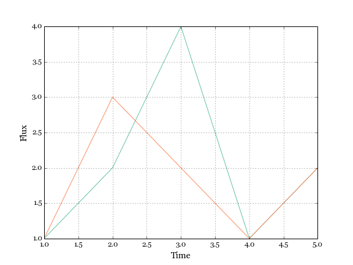
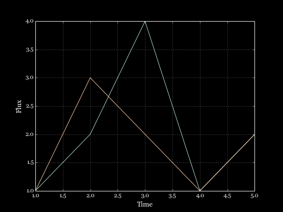

About
-----

The purpose of this package is to collect and provide high-quality
[Matplotlib](http://www.matplotlib.org) styles.

Customizing the look of Matplotlib plots is relatively easy thanks to the [rc parameter framework](http://matplotlib.org/users/customizing.html). For
example, you can easily set the font for your plot using:

    plt.rcParams['font.family'] = 'Georgia'

However, you may have to tweak quite a few such parameters to get a good
looking plot. The present package leverages the rc parameter framework to
provide presets that save you time if you want to just get a good looking plot
fast.

Future versions of Matplotlib will likely include the ability to select such presets (or 'style sheets') - see  [https://github.com/matplotlib/matplotlib/pull/2236](https://github.com/matplotlib/matplotlib/pull/2236). Once this is available, the styles in this repository will be adapted so as to be usable by the new Matplotlib framework.

Contributing
------------

The aim of this package is to collaboratively come up with a set of
high-quality styles. Please contribute styles to ``mpl_styles/styles.py``.
Simply define a function named ``style_<style_name>`` that takes no arguments,
and returns a dictionary of Matplotlib rc parameter settings.

Installing
----------

This package is still in development, but you can install the latest developer
version with:

    git clone https://github.com/astrofrog/mpl_styles.git
    cd mpl_styles
    python setup.py install

Using styles
------------

You can either set a global style for the rest of the script:

    mpl_styles.use('style_name')

    fig = plt.figure()
    ax = fig.add_subplot(1,1,1)
    ...

or make use of the context manager to temporarily change the style:

    with mpl_styles.use('style_name'):

        fig = plt.figure()
        ax = fig.add_subplot(1,1,1)
        ...

Available styles
----------------

The following styles are currently available:

* ``'test'`` - a test style:

* ``'white_on_black'`` - a style for presentations with black backgrounds

This package is under development. We are curerntly working on a set of styles!
Please also contribute your own! (see *Contributing* above).

Fonts
-----

Note that you will need to make sure that fonts that are needed for specific
styles are present in TTF format on your system (which not all default system
fonts will be). A great resource for free fonts is [Google Web Fonts](http://www.google.com/fonts).

Other useful helpers
--------------------

### Improved Log Formatter

The default log formatter is Matplotlib is sub-optimal = it returns values such
as 10^0, 10^1, etc. To use a more sensible log formatter, you can do:

    from mpl_styles.formatters import LogFormatterMathtextAuto

    fig = plt.figure()
    ax = fig.add_subplot(1,1,1)
    ax.xaxis.set_major_formatter(LogFormatterMathtextAuto())  # for the x axis
    ax.yaxis.set_major_formatter(LogFormatterMathtextAuto())  # for the y axis
    ...

and values between (and including) 0.01 and 100 will be rendered in decimal,
not exponential notation. If you use the interactive pylab interface, you need to instead make the plot and then:

    ...
    from mpl_styles.formatters import LogFormatterMathtextAuto
    gca().xaxis.set_major_formatter(LogFormatterMathtextAuto())  # for the x axis
    gca().yaxis.set_major_formatter(LogFormatterMathtextAuto())  # for the y axis
    gcf().canvas.draw()

If you make a plot with multiple subplots, you will need to run the
``gca()...`` command after making each sub-plot, and the
``gcf().canvas.draw()`` command after you are done setting all the formatters.

Credits
-------

Package inspired from a discussion with João Alves (University of Vienna)
